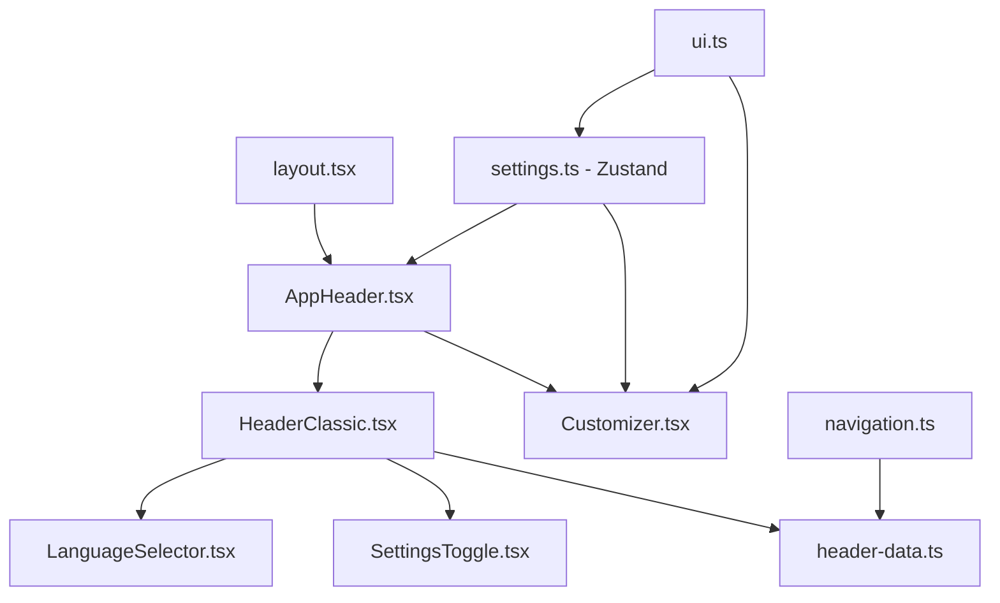

# Header Global - Documentação Completa

## Visão Geral

O header global é um componente fundamental da aplicação que combina navegação, personalização e controles de idioma. Ele é implementado através de uma arquitetura modular que segue as convenções do projeto, com separação clara entre dados, componentes visuais e estado.

## Estrutura de Arquivos

```
src/
├── app/
│   └── layout.tsx                           # Layout raiz que inclui AppHeader
├── components/
│   ├── layout/
│   │   └── AppHeader.tsx                     # Componente orquestrador do header global
│   ├── blocks/
│   │   └── header/
│   │       ├── HeaderClassic.tsx              # Implementação principal do header
│   │       ├── HeaderFloating.tsx             # Variante flutuante (não usada atualmente)
│   │       ├── HeaderMegaMenu.tsx             # Variante com menu expandido
│   │       ├── HeaderSidebar.tsx              # Variante com sidebar
│   │       └── common/
│   │           ├── header-data.ts             # Dados de navegação centralizados
│   │           ├── LanguageSelector.tsx       # Seletor de idioma
│   │           └── SettingsToggle.tsx          # Botão de configurações
│   └── ui/
│       └── customizer.tsx                    # Painel de personalização
├── stores/
│   └── settings.ts                           # Estado global (Zustand)
└── types/
    └── domains/
        ├── navigation.ts                     # Tipos de navegação
        └── ui.ts                            # Tipos de UI e configurações
```

## Fluxo de Dados e Componentes



## Código Completo dos Componentes

### 1. Layout Raiz (`src/app/layout.tsx`)

```tsx
import { siteMetadata } from '@/lib/metadata';
import { geistSans, geistMono } from '@/lib/fonts';

import { Providers } from '@/components/layout/Providers';
import { AppHeader } from '@/components/layout/AppHeader';
import { AppMain } from '@/components/layout/AppMain';
import './globals.css';

export const metadata = siteMetadata;

export default function RootLayout({
  children,
}: Readonly<{
  children: React.ReactNode;
}>) {
  return (
    <html lang="en" suppressHydrationWarning>
      <body className={`${geistSans.variable} ${geistMono.variable} antialiased`}>
        <Providers>
          <AppHeader />
          <AppMain>{children}</AppMain>
        </Providers>
      </body>
    </html>
  );
}
```

### 2. Componente Orquestrador (`src/components/layout/AppHeader.tsx`)

```tsx
'use client';

import { useState } from 'react';
import { useSettingsStore } from '@/stores/settings';
import HeaderClassic from '@/components/blocks/header/HeaderClassic';
import { Customizer, CUSTOMIZER_CONFIG } from '@/components/ui/customizer';

export function AppHeader() {
  const { handleSettingChange, ...settings } = useSettingsStore();
  const [isCustomizerOpen, setIsCustomizerOpen] = useState(false);

  return (
    <HeaderClassic
      onSettingsClick={() => setIsCustomizerOpen(!isCustomizerOpen)}
      isSettingsOpen={isCustomizerOpen}
    >
      <Customizer
        config={CUSTOMIZER_CONFIG}
        currentValues={{
          color: settings.color,
          size: settings.size,
          background: settings.background,
          loop: settings.loop,
        }}
        onChange={handleSettingChange}
        isOpen={isCustomizerOpen}
        onClose={() => setIsCustomizerOpen(false)}
        hideToggle
      />
    </HeaderClassic>
  );
}
```

### 3. Header Principal (`src/components/blocks/header/HeaderClassic.tsx`)

```tsx
'use client';

import React, { useState, useEffect, ReactNode } from 'react';
import Link from 'next/link';
import { LanguageSelector } from './common/LanguageSelector';
import { SettingsToggle } from './common/SettingsToggle';
import { cn } from '@/lib/utils';
import { AnimatePresence, motion } from 'framer-motion';

interface HeaderClassicProps {
  onSettingsClick?: () => void;
  isSettingsOpen?: boolean;
  children?: ReactNode;
}

export default function HeaderClassic({
  onSettingsClick,
  isSettingsOpen,
  children,
}: HeaderClassicProps) {
  const [isScrolled, setIsScrolled] = useState(false);

  useEffect(() => {
    const handleScroll = () => {
      setIsScrolled(window.scrollY > 10);
    };

    window.addEventListener('scroll', handleScroll, { passive: true });
    return () => window.removeEventListener('scroll', handleScroll);
  }, []);

  return (
    <header
      className={cn(
        'fixed top-0 left-0 right-0 z-50 transition-[height,background-color,box-shadow,padding] duration-500',
        isScrolled ? 'bg-cv-bg-card/80 backdrop-blur-md shadow-sm' : 'bg-transparent py-2'
      )}
      style={{
        height: isScrolled ? 'var(--cv-header-height-scrolled)' : 'var(--cv-header-height)',
      }}
    >
      <div className="container mx-auto flex h-full items-center justify-between px-6 md:px-12 max-w-7xl">
        {/* Logo */}
        <Link
          href="/"
          className="group flex items-baseline gap-0 text-lg md:text-xl font-semibold tracking-tighter transition-transform active:scale-95"
        >
          <span className="text-white">
            <span className="hidden md:inline">PEDRO</span>
            <span className="md:hidden">P</span>
          </span>
          <span className="text-cv-accent">.ZABEU</span>
        </Link>

        {/* Actions */}
        <div className="flex items-center gap-3 relative">
          <LanguageSelector />

          <div className="relative">
            <SettingsToggle onClick={onSettingsClick} isOpen={isSettingsOpen} />

            {/* Customizer dropdown */}
            <AnimatePresence>
              {isSettingsOpen && children && (
                <motion.div
                  initial={{ opacity: 0, y: 10, scale: 0.95 }}
                  animate={{ opacity: 1, y: 0, scale: 1 }}
                  exit={{ opacity: 0, y: 10, scale: 0.95 }}
                  transition={{ type: 'spring', stiffness: 400, damping: 25 }}
                  className="absolute top-full right-0 mt-3 origin-top-right z-50"
                >
                  {children}
                </motion.div>
              )}
            </AnimatePresence>
          </div>
        </div>
      </div>

      {/* Bottom separation line */}
      <div className="absolute bottom-0 left-0 right-0 h-[1px] overflow-hidden">
        <motion.div
          className="w-full h-full bg-gradient-to-r from-transparent via-cv-accent/30 to-transparent"
          initial={{ scaleX: 0, opacity: 0 }}
          animate={{
            scaleX: isScrolled ? 1 : 0.6,
            opacity: isScrolled ? 1 : 0.4,
          }}
          transition={{ duration: 0.8, ease: 'easeInOut' }}
        />

        {/* Moving Shine Effect */}
        <motion.div
          className="absolute inset-0 h-full flex"
          style={{ width: '200%' }}
          animate={{
            x: [0, '-50%'],
          }}
          transition={{
            duration: 25,
            repeat: Infinity,
            ease: 'linear',
          }}
        >
          <div className="w-1/2 h-full bg-[linear-gradient(90deg,transparent_45%,var(--cv-accent)_50%,transparent_55%)] opacity-50" />
          <div className="w-1/2 h-full bg-[linear-gradient(90deg,transparent_45%,var(--cv-accent)_50%,transparent_55%)] opacity-50" />
        </motion.div>
      </div>
    </header>
  );
}
```

### 4. Dados de Navegação (`src/components/blocks/header/common/header-data.ts`)

```typescript
import {
  Home,
  Briefcase,
  BookOpen,
  User,
  Mail,
  Zap,
  BarChart,
  GraduationCap,
  LineChart,
  Code,
} from 'lucide-react';
import type { NavItem } from '@/types';

export const headerData: NavItem[] = [
  {
    title: 'Home',
    href: '/',
    icon: Home,
  },
  {
    title: 'Projects',
    href: '/projects',
    icon: Briefcase,
    children: [
      {
        title: 'Stakely',
        href: '/projects/stakely',
        description: 'Tips e apuração individualizada',
        icon: Zap,
      },
      {
        title: 'Betting Mgmt',
        href: '/projects/betting-mgmt',
        description: 'Sistema de Gestão de Contas',
        icon: BarChart,
      },
      {
        title: 'School of Bets',
        href: '/projects/school-of-bets',
        description: 'Plataforma de aprendizado',
        icon: GraduationCap,
      },
      {
        title: 'Predictive Models',
        href: '/projects/models',
        description: 'AI-driven sports predictions',
        icon: LineChart,
      },
    ],
  },
  {
    title: 'Resources',
    href: '/resources',
    icon: BookOpen,
    children: [
      {
        title: 'Blog',
        href: '/blog',
        description: 'Thoughts on tech and betting',
        icon: BookOpen,
      },
      {
        title: 'Snippets',
        href: '/snippets',
        description: 'Reusable code components',
        icon: Code,
      },
    ],
  },
  {
    title: 'About',
    href: '/about',
    icon: User,
  },
  {
    title: 'Contact',
    href: '/contact',
    icon: Mail,
  },
];
```

### 5. Seletor de Idioma (`src/components/blocks/header/common/LanguageSelector.tsx`)

```tsx
'use client';

import React from 'react';
import { Globe } from 'lucide-react';
import { useSettingsStore } from '@/stores/settings';

export function LanguageSelector() {
  const { language, setLanguage } = useSettingsStore();

  const toggleLang = () => {
    setLanguage(language === 'en' ? 'pt' : 'en');
  };

  return (
    <button
      onClick={toggleLang}
      className="flex items-center gap-1.5 px-3 py-1.5 text-sm font-medium rounded-full bg-cv-bg-card hover:bg-cv-bg-card-hover transition-colors backdrop-blur-sm border border-cv-border-muted text-cv-text-primary"
      aria-label="Toggle Language"
    >
      <Globe className="w-4 h-4" />
      <span className="uppercase">{language}</span>
    </button>
  );
}
```

### 6. Botão de Configurações (`src/components/blocks/header/common/SettingsToggle.tsx`)

```tsx
'use client';

import React from 'react';
import { Settings } from 'lucide-react';

interface SettingsToggleProps {
  onClick?: () => void;
  isOpen?: boolean;
}

export function SettingsToggle({ onClick, isOpen }: SettingsToggleProps) {
  return (
    <div className="flex items-center gap-2">
      <button
        onClick={onClick}
        className={`p-2 rounded-full bg-cv-bg-card hover:bg-cv-bg-card-hover transition-colors backdrop-blur-sm border border-cv-border-muted ${
          isOpen ? 'text-cv-accent border-cv-accent/50' : 'text-cv-text-primary'
        }`}
        aria-label="Settings"
      >
        <Settings className={`w-4 h-4 ${isOpen ? 'rotate-90' : ''} transition-transform`} />
      </button>
    </div>
  );
}
```

### 7. Store de Configurações (`src/stores/settings.ts`)

```typescript
import { create } from 'zustand';
import { persist } from 'zustand/middleware';
import type { CustomizerBackground, SizeVariant, AccentColor, SettingsStore } from '@/types';

export const useSettingsStore = create<SettingsStore>()(
  persist(
    (set) => ({
      // Initial values
      language: 'en',
      color: 'teal',
      size: 'default',
      background: 'slate',
      loop: 'on',

      // Setters
      setLanguage: (language) => set({ language }),
      setAccentColor: (color) => set({ color }),
      setSize: (size) => set({ size }),
      setBackground: (background) => set({ background }),
      setLoop: (loop) => set({ loop }),

      // Generic handler
      handleSettingChange: (key, value) => {
        set(() => {
          // Type safety checks
          if (key === 'color') return { color: value as AccentColor };
          if (key === 'background') return { background: value as CustomizerBackground };
          if (key === 'size') return { size: value as SizeVariant };
          if (key === 'loop') return { loop: value as 'on' | 'off' };

          return {};
        });
      },
    }),
    {
      name: 'cv-settings-storage',
      partialize: (state) => ({
        language: state.language,
        color: state.color,
        background: state.background,
      }),
    }
  )
);
```

### 8. Tipos de Navegação (`src/types/domains/navigation.ts`)

```typescript
import { LucideIcon } from 'lucide-react';

export interface NavItem {
  title: string;
  href: string;
  icon?: LucideIcon;
  description?: string;
  children?: NavItem[];
}

import React from 'react';

export interface FloatingNavProps {
  navItems: {
    name: string;
    link: string;
    icon?: React.ReactNode;
  }[];
  className?: string;
}
```

### 9. Tipos de UI (`src/types/domains/ui.ts`)

```typescript
// UI & GLOBAL TYPES
export type Language = 'pt' | 'en';
export type CustomizerBackground = 'black' | 'slate' | 'navy';
export type SizeVariant = 'small' | 'default' | 'large';
export type AccentColor =
  | 'teal'
  | 'blue'
  | 'violet'
  | 'emerald'
  | 'rose'
  | 'cyan'
  | 'amber'
  | 'pink';

// Background color values
export const BACKGROUND_COLOR_VALUES: Record<CustomizerBackground, string> = {
  black: '#000000',
  slate: '#0f172a',
  navy: '#0a1628',
} as const;

// Background classes
export const BACKGROUND_CLASSES: Record<CustomizerBackground, string> = {
  black: 'bg-cv-bg-primary',
  slate: 'bg-cv-bg-secondary',
  navy: 'bg-cv-bg-navy',
};

// Settings Store Type
export interface SettingsStore {
  language: Language;
  color: AccentColor;
  size: SizeVariant;
  background: CustomizerBackground;
  loop: 'on' | 'off';

  // Actions
  setLanguage: (language: Language) => void;
  setAccentColor: (color: AccentColor) => void;
  setSize: (size: SizeVariant) => void;
  setBackground: (background: CustomizerBackground) => void;
  setLoop: (loop: 'on' | 'off') => void;

  // Generic handler for customizer
  handleSettingChange: (key: string, value: string) => void;
}

// Color preview classes
export const ACCENT_COLOR_PREVIEW_CLASSES: Record<string, string> = {
  teal: 'bg-teal-500',
  blue: 'bg-blue-500',
  violet: 'bg-violet-500',
  emerald: 'bg-emerald-500',
  rose: 'bg-rose-500',
  cyan: 'bg-cyan-500',
  amber: 'bg-amber-500',
  pink: 'bg-pink-500',
} as const;
```

## Funcionalidades Principais

### 1. **Navegação Responsiva**

- Logo com link para home
- Menu estruturado com ícones e submenus
- Suporte para navegação aninhada (children)

### 2. **Personalização em Tempo Real**

- Seletor de cores (8 opções)
- Controle de tamanho (compact, default, large)
- Escolha de background (black, slate, navy)
- Controle de animação/loop

### 3. **Internacionalização**

- Toggle entre português e inglês
- Estado persistido no localStorage
- Ícone global representativo

### 4. **Efeitos Visuais**

- Header muda aparência ao rolar (scroll)
- Linha decorativa com efeito shine animado
- Transições suaves com Framer Motion
- Backdrop blur e sombras dinâmicas

### 5. **Estado Global**

- Zustand para gerenciamento centralizado
- Persistência automática das configurações
- Tipagem TypeScript completa

## Personalização e Extensão

### Adicionar Novas Cores

1. Atualizar `AccentColor` em `types/domains/ui.ts`
2. Adicionar valores em `ACCENT_COLOR_PREVIEW_CLASSES`
3. Incluir em `CUSTOMIZER_CONFIG` no `customizer.tsx`

### Modificar Estrutura de Navegação

1. Editar `header-data.ts` com novos itens
2. Usar ícones do Lucide React
3. Aproveitar estrutura aninhada para submenus

### Customizar Comportamento do Scroll

1. Modificar lógica em `HeaderClassic.tsx`
2. Ajustar valores de CSS variables
3. Personalizar animações e transições

## Boas Práticas

1. **Tipagem Forte**: Todos os componentes usam TypeScript interfaces
2. **Separação de Responsabilidades**: Dados, UI e estado são separados
3. **Acessibilidade**: Aria labels e semântica HTML
4. **Performance**: Lazy loading e animações otimizadas
5. **Consistência**: Segue convenções de nomenclatura e estrutura do projeto

## Dependencies Principais

- **React 19**: Componentes e hooks
- **Next.js 16**: App Router e otimização
- **Framer Motion**: Animações e transições
- **Zustand**: Gerenciamento de estado
- **Lucide React**: Ícones consistentes
- **Tailwind CSS**: Estilização utilitária
