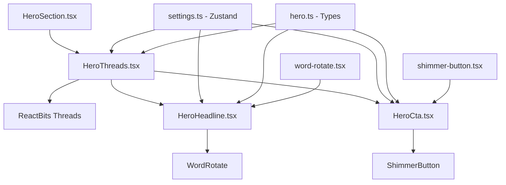

# Hero com Threads - Documentação Completa

## Visão Geral

O Hero com Threads é uma implementação impressionante que combina animação WebGL avançada com tipografia dinâmica e interatividade. Utiliza o componente Threads da ReactBits para criar um fundo animado com linhas onduladas que respondem ao movimento do mouse, enquanto exibe conteúdo hero com rotação de palavras e botões com efeito shimmer.

## Estrutura de Arquivos

```
src/
├── components/
│   ├── sections/
│   │   └── HeroSection.tsx                    # [📁](file:///Users/pedroivozabeu/Projetos/cv/src/components/sections/HeroSection.tsx) Componente orquestrador principal
│   ├── blocks/
│   │   └── Hero/
│   │       ├── HeroThreads.tsx                # [📁](file:///Users/pedroivozabeu/Projetos/cv/src/components/blocks/Hero/HeroThreads.tsx) Implementação principal com threads
│   │       ├── HeroHeadline.tsx               # [📁](file:///Users/pedroivozabeu/Projetos/cv/src/components/blocks/Hero/HeroHeadline.tsx) Título com rotação de palavras
│   │       ├── HeroCta.tsx                    # [📁](file:///Users/pedroivozabeu/Projetos/cv/src/components/blocks/Hero/HeroCta.tsx) Botões de call-to-action
│   │       ├── HeroHeader.tsx                 # [📁](file:///Users/pedroivozabeu/Projetos/cv/src/components/blocks/Hero/HeroHeader.tsx) Header alternativo (não usado aqui)
│   │       └── index.tsx                      # [📁](file:///Users/pedroivozabeu/Projetos/cv/src/components/blocks/Hero/index.tsx) Export centralizado
│   ├── reactbits/
│   │   └── threads.tsx                        # [📁](file:///Users/pedroivozabeu/Projetos/cv/src/components/reactbits/threads.tsx) Componente WebGL das threads
│   └── ui/
│       ├── word-rotate.tsx                     # [📁](file:///Users/pedroivozabeu/Projetos/cv/src/components/ui/word-rotate.tsx) Componente de rotação de palavras
│       └── shimmer-button.tsx                  # [📁](file:///Users/pedroivozabeu/Projetos/cv/src/components/ui/shimmer-button.tsx) Botões com efeito shimmer
├── types/
│   └── domains/
│       └── hero.ts                            # [📁](file:///Users/pedroivozabeu/Projetos/cv/src/types/domains/hero.ts) Tipos e constantes do hero
└── stores/
    └── settings.ts                            # [📁](file:///Users/pedroivozabeu/Projetos/cv/src/stores/settings.ts) Estado global para personalização
```

### 🔗 Links Diretos para Agentes Externos

Para facilitar o acesso por agentes de outros projetos, todos os arquivos estão disponíveis diretamente:

- **Principal**: [HeroThreads.tsx](file:///Users/pedroivozabeu/Projetos/cv/src/components/blocks/Hero/HeroThreads.tsx)
- **WebGL**: [threads.tsx](file:///Users/pedroivozabeu/Projetos/cv/src/components/reactbits/threads.tsx)
- **Tipografia**: [HeroHeadline.tsx](file:///Users/pedroivozabeu/Projetos/cv/src/components/blocks/Hero/HeroHeadline.tsx)
- **Botões**: [HeroCta.tsx](file:///Users/pedroivozabeu/Projetos/cv/src/components/blocks/Hero/HeroCta.tsx)
- **WordRotate**: [word-rotate.tsx](file:///Users/pedroivozabeu/Projetos/cv/src/components/ui/word-rotate.tsx)
- **ShimmerButton**: [shimmer-button.tsx](file:///Users/pedroivozabeu/Projetos/cv/src/components/ui/shimmer-button.tsx)
- **Tipos**: [hero.ts](file:///Users/pedroivozabeu/Projetos/cv/src/types/domains/hero.ts)
- **Estado**: [settings.ts](file:///Users/pedroivozabeu/Projetos/cv/src/stores/settings.ts)
- **Orquestrador**: [HeroSection.tsx](file:///Users/pedroivozabeu/Projetos/cv/src/components/sections/HeroSection.tsx)

## Fluxo de Dados e Componentes



## Código Completo dos Componentes

### 1. Seção Hero ([`src/components/sections/HeroSection.tsx`](file:///Users/pedroivozabeu/Projetos/cv/src/components/sections/HeroSection.tsx))

```tsx
'use client';

import { HeroThreads } from '@/components/blocks/Hero';

export function HeroSection() {
  return (
    <section id="hero" className="w-full">
      <HeroThreads />
    </section>
  );
}
```

### 2. Hero Principal com Threads ([`src/components/blocks/Hero/HeroThreads.tsx`](file:///Users/pedroivozabeu/Projetos/cv/src/components/blocks/Hero/HeroThreads.tsx))

```tsx
'use client';

import { useMemo } from 'react';
import dynamic from 'next/dynamic';
import { motion, AnimatePresence } from 'framer-motion';
import { useSettingsStore } from '@/stores/settings';
import { HeroHeadline, HeroCta } from '@/components/blocks/Hero';
import { HERO_TEXTS, type SizeVariant, HERO_THREADS_COLORS } from '@/types';
import { cn } from '@/lib/utils';

// Dynamic import para evitar SSR issues com WebGL
const Threads = dynamic(() => import('@/components/reactbits/threads'), {
  ssr: false,
  loading: () => <div className="absolute inset-0 bg-cv-bg-secondary" />,
});

interface HeroThreadsProps {
  className?: string;
}

export function HeroThreads({ className }: HeroThreadsProps) {
  const { language, color, size, loop } = useSettingsStore();

  // Memoize thread color para evitar re-renders desnecessários
  const threadColor = useMemo(
    () => HERO_THREADS_COLORS[color] || HERO_THREADS_COLORS.teal,
    [color]
  );

  return (
    <div
      className={cn(
        'relative min-h-[100dvh] w-full overflow-hidden flex flex-col items-center justify-center px-6',
        className
      )}
      style={{ backgroundColor: 'var(--cv-bg-main)' }}
    >
      {/* Threads Background */}
      <div className="absolute inset-0 z-0">
        <Threads color={threadColor} amplitude={2.5} distance={0.8} enableMouseInteraction={true} />
      </div>

      {/* Content */}
      <motion.div
        initial={{ opacity: 0 }}
        animate={{ opacity: 1 }}
        transition={{ duration: 0.6 }}
        className="relative z-10 text-center max-w-4xl"
      >
        <HeroHeadline
          language={language}
          showRotation={loop === 'on'}
          size={size as SizeVariant}
          className="mb-12"
        />

        <div className="overflow-hidden mb-12">
          <AnimatePresence mode="wait">
            <motion.p
              key={`subtitle-${language}`}
              initial={{ opacity: 0, y: 20, filter: 'blur(4px)' }}
              animate={{ opacity: 1, y: 0, filter: 'blur(0px)' }}
              exit={{ opacity: 0, y: -20, filter: 'blur(4px)' }}
              transition={{ duration: 0.3, delay: 0.2, ease: 'easeOut' }}
              className="text-cv-text-muted text-lg md:text-xl max-w-2xl mx-auto"
            >
              {HERO_TEXTS[language].subtitle}
            </motion.p>
          </AnimatePresence>
        </div>
      </motion.div>
    </div>
  );
}
```

### 3. Componente Threads WebGL ([`src/components/reactbits/threads.tsx`](file:///Users/pedroivozabeu/Projetos/cv/src/components/reactbits/threads.tsx))

```tsx
'use client';

import React, { useEffect, useRef } from 'react';
import { Renderer, Program, Mesh, Triangle, Color } from 'ogl';

interface ThreadsProps {
  color?: [number, number, number];
  amplitude?: number;
  distance?: number;
  enableMouseInteraction?: boolean;
  className?: string;
}

const vertexShader = `
attribute vec2 position;
attribute vec2 uv;
varying vec2 vUv;
void main() {
  vUv = uv;
  gl_Position = vec4(position, 0.0, 1.0);
}
`;

const fragmentShader = `
precision highp float;

uniform float iTime;
uniform vec3 iResolution;
uniform vec3 uColor;
uniform float uAmplitude;
uniform float uDistance;
uniform vec2 uMouse;

#define PI 3.1415926538

const int u_line_count = 40;
const float u_line_width = 7.0;
const float u_line_blur = 10.0;

float Perlin2D(vec2 P) {
    vec2 Pi = floor(P);
    vec4 Pf_Pfmin1 = P.xyxy - vec4(Pi, Pi + 1.0);
    vec4 Pt = vec4(Pi.xy, Pi.xy + 1.0);
    Pt = Pt - floor(Pt * (1.0 / 71.0)) * 71.0;
    Pt += vec2(26.0, 161.0).xyxy;
    Pt *= Pt;
    Pt = Pt.xzxz * Pt.yyww;
    vec4 hash_x = fract(Pt * (1.0 / 951.135664));
    vec4 hash_y = fract(Pt * (1.0 / 642.949883));
    vec4 grad_x = hash_x - 0.49999;
    vec4 grad_y = hash_y - 0.49999;
    vec4 grad_results = inversesqrt(grad_x * grad_x + grad_y * grad_y)
        * (grad_x * Pf_Pfmin1.xzxz + grad_y * Pf_Pfmin1.yyww);
    grad_results *= 1.4142135623730950;
    vec2 blend = Pf_Pfmin1.xy * Pf_Pfmin1.xy * Pf_Pfmin1.xy
               * (Pf_Pfmin1.xy * (Pf_Pfmin1.xy * 6.0 - 15.0) + 10.0);
    vec4 blend2 = vec4(blend, vec2(1.0 - blend));
    return dot(grad_results, blend2.zxzx * blend2.wwyy);
}

float pixel(float count, vec2 resolution) {
    return (1.0 / max(resolution.x, resolution.y)) * count;
}

float lineFn(vec2 st, float width, float perc, float offset, vec2 mouse, float time, float amplitude, float distance) {
    float split_offset = (perc * 0.4);
    float split_point = 0.1 + split_offset;

    float amplitude_normal = smoothstep(split_point, 0.7, st.x);
    float amplitude_strength = 0.5;
    float finalAmplitude = amplitude_normal * amplitude_strength
                           * amplitude * (1.0 + (mouse.y - 0.5) * 0.2);

    float time_scaled = time / 10.0 + (mouse.x - 0.5) * 1.0;
    float blur = smoothstep(split_point, split_point + 0.05, st.x) * perc;

    float xnoise = mix(
        Perlin2D(vec2(time_scaled, st.x + perc) * 2.5),
        Perlin2D(vec2(time_scaled, st.x + time_scaled) * 3.5) / 1.5,
        st.x * 0.3
    );

    float y = 0.5 + (perc - 0.5) * distance + xnoise / 2.0 * finalAmplitude;

    float line_start = smoothstep(
        y + (width / 2.0) + (u_line_blur * pixel(1.0, iResolution.xy) * blur),
        y,
        st.y
    );

    float line_end = smoothstep(
        y,
        y - (width / 2.0) - (u_line_blur * pixel(1.0, iResolution.xy) * blur),
        st.y
    );

    return clamp(
        (line_start - line_end) * (1.0 - smoothstep(0.0, 1.0, pow(perc, 0.3))),
        0.0,
        1.0
    );
}

void mainImage(out vec4 fragColor, in vec2 fragCoord) {
    vec2 uv = fragCoord / iResolution.xy;

    float line_strength = 1.0;
    for (int i = 0; i < u_line_count; i++) {
        float p = float(i) / float(u_line_count);
        line_strength *= (1.0 - lineFn(
            uv,
            u_line_width * pixel(1.0, iResolution.xy) * (1.0 - p),
            p,
            (PI * 1.0) * p,
            uMouse,
            iTime,
            uAmplitude,
            uDistance
        ));
    }

    float colorVal = 1.0 - line_strength;
    fragColor = vec4(uColor * colorVal, colorVal);
}

void main() {
    mainImage(gl_FragColor, gl_FragCoord.xy);
}
`;

export function Threads({
  color = [1, 1, 1],
  amplitude = 1,
  distance = 0,
  enableMouseInteraction = false,
  className = '',
}: ThreadsProps) {
  const containerRef = useRef<HTMLDivElement>(null);
  const animationFrameId = useRef<number | null>(null);

  useEffect(() => {
    if (!containerRef.current) return;
    const container = containerRef.current;

    const renderer = new Renderer({ alpha: true });
    const gl = renderer.gl;
    gl.clearColor(0, 0, 0, 0);
    gl.enable(gl.BLEND);
    gl.blendFunc(gl.SRC_ALPHA, gl.ONE_MINUS_SRC_ALPHA);
    container.appendChild(gl.canvas);

    const geometry = new Triangle(gl);
    const program = new Program(gl, {
      vertex: vertexShader,
      fragment: fragmentShader,
      uniforms: {
        iTime: { value: 0 },
        iResolution: {
          value: new Color(gl.canvas.width, gl.canvas.height, gl.canvas.width / gl.canvas.height),
        },
        uColor: { value: new Color(...color) },
        uAmplitude: { value: amplitude },
        uDistance: { value: distance },
        uMouse: { value: new Float32Array([0.5, 0.5]) },
      },
    });

    const mesh = new Mesh(gl, { geometry, program });

    function resize() {
      const { clientWidth, clientHeight } = container;
      renderer.setSize(clientWidth, clientHeight);
      program.uniforms.iResolution.value.r = clientWidth;
      program.uniforms.iResolution.value.g = clientHeight;
      program.uniforms.iResolution.value.b = clientWidth / clientHeight;
    }
    window.addEventListener('resize', resize);
    resize();

    const currentMouse = [0.5, 0.5];
    let targetMouse = [0.5, 0.5];

    function handleMouseMove(e: MouseEvent) {
      const rect = container.getBoundingClientRect();
      const x = (e.clientX - rect.left) / rect.width;
      const y = 1.0 - (e.clientY - rect.top) / rect.height;
      targetMouse = [x, y];
    }
    function handleMouseLeave() {
      targetMouse = [0.5, 0.5];
    }
    if (enableMouseInteraction) {
      container.addEventListener('mousemove', handleMouseMove);
      container.addEventListener('mouseleave', handleMouseLeave);
    }

    function update(t: number) {
      if (enableMouseInteraction) {
        const smoothing = 0.05;
        currentMouse[0] += smoothing * (targetMouse[0] - currentMouse[0]);
        currentMouse[1] += smoothing * (targetMouse[1] - currentMouse[1]);
        program.uniforms.uMouse.value[0] = currentMouse[0];
        program.uniforms.uMouse.value[1] = currentMouse[1];
      } else {
        program.uniforms.uMouse.value[0] = 0.5;
        program.uniforms.uMouse.value[1] = 0.5;
      }
      program.uniforms.iTime.value = t * 0.001;

      renderer.render({ scene: mesh });
      animationFrameId.current = requestAnimationFrame(update);
    }
    animationFrameId.current = requestAnimationFrame(update);

    return () => {
      if (animationFrameId.current) cancelAnimationFrame(animationFrameId.current);
      window.removeEventListener('resize', resize);

      if (enableMouseInteraction) {
        container.removeEventListener('mousemove', handleMouseMove);
        container.removeEventListener('mouseleave', handleMouseLeave);
      }
      if (container.contains(gl.canvas)) container.removeChild(gl.canvas);
      gl.getExtension('WEBGL_lose_context')?.loseContext();
    };
  }, [color, amplitude, distance, enableMouseInteraction]);

  return <div ref={containerRef} className={`w-full h-full relative ${className}`} />;
}

export default Threads;
```

### 4. Headline com Rotação ([`src/components/blocks/Hero/HeroHeadline.tsx`](file:///Users/pedroivozabeu/Projetos/cv/src/components/blocks/Hero/HeroHeadline.tsx))

```tsx
'use client';

import { cn } from '@/lib/utils';
import { motion, AnimatePresence } from 'framer-motion';
import { WordRotate } from '@/components/ui/word-rotate';
import { EXPERTISE_AREAS, HERO_TEXTS, type Language } from '@/types';

interface HeroHeadlineProps {
  language: Language;
  showRotation?: boolean;
  accentColor?: string;
  className?: string;
  headlineClassName?: string;
  size?: 'compact' | 'default' | 'large';
}

const sizeClasses = {
  compact: {
    headline: 'text-3xl md:text-4xl lg:text-5xl',
    area: 'text-3xl md:text-4xl lg:text-5xl',
  },
  default: {
    headline: 'text-4xl md:text-5xl lg:text-6xl',
    area: 'text-4xl md:text-5xl lg:text-6xl',
  },
  large: {
    headline: 'text-5xl md:text-6xl lg:text-7xl',
    area: 'text-5xl md:text-6xl lg:text-7xl',
  },
};

export function HeroHeadline({
  language,
  showRotation = true,
  className,
  headlineClassName,
  size = 'default',
}: HeroHeadlineProps) {
  const texts = HERO_TEXTS[language];
  const areas = EXPERTISE_AREAS[language];
  const sizes = sizeClasses[size];

  return (
    <div className={cn('flex flex-col items-center text-center', className)}>
      <AnimatePresence mode="wait">
        <motion.h1
          key={`headline-${language}`}
          initial={{ opacity: 0, y: 20, filter: 'blur(4px)' }}
          animate={{ opacity: 1, y: 0, filter: 'blur(0px)' }}
          exit={{ opacity: 0, y: -20, filter: 'blur(4px)' }}
          transition={{ duration: 0.3, ease: 'easeOut' }}
          className={cn(
            'font-bold text-cv-text-primary leading-tight tracking-tight',
            sizes.headline,
            headlineClassName
          )}
        >
          {texts.headline}
        </motion.h1>
      </AnimatePresence>

      {showRotation && (
        <AnimatePresence mode="wait">
          <motion.div
            key={`rotation-${language}`}
            initial={{ opacity: 0, y: 20, filter: 'blur(4px)' }}
            animate={{ opacity: 1, y: 0, filter: 'blur(0px)' }}
            exit={{ opacity: 0, y: -20, filter: 'blur(4px)' }}
            transition={{ duration: 0.3, ease: 'easeOut' }}
          >
            <WordRotate
              words={[...areas]}
              duration={3000}
              className={cn('font-bold text-cv-accent', sizes.area)}
              motionProps={{
                initial: { opacity: 0, y: -30, filter: 'blur(4px)' },
                animate: { opacity: 1, y: 0, filter: 'blur(0px)' },
                exit: { opacity: 0, y: 30, filter: 'blur(4px)' },
                transition: { duration: 0.4, ease: 'easeOut' },
              }}
            />
          </motion.div>
        </AnimatePresence>
      )}
    </div>
  );
}
```

### 5. Botões Call-to-Action ([`src/components/blocks/Hero/HeroCta.tsx`](file:///Users/pedroivozabeu/Projetos/cv/src/components/blocks/Hero/HeroCta.tsx))

```tsx
'use client';

import { cn } from '@/lib/utils';
import { motion, AnimatePresence } from 'framer-motion';
import { ShimmerButton } from '@/components/ui/shimmer-button';
import { HERO_TEXTS, type Language } from '@/types';

interface HeroCtaProps {
  language: Language;
  className?: string;
  variant?: 'default' | 'stacked';
}

export function HeroCta({ language, className, variant = 'default' }: HeroCtaProps) {
  const texts = HERO_TEXTS[language];

  return (
    <motion.div
      initial={{ opacity: 0, y: 20, filter: 'blur(4px)' }}
      animate={{ opacity: 1, y: 0, filter: 'blur(0px)' }}
      transition={{ duration: 0.6, delay: 0.8 }}
      className={cn(
        'flex gap-4',
        variant === 'stacked' ? 'flex-col w-full max-w-xs' : 'flex-col sm:flex-row',
        className
      )}
    >
      <ShimmerButton
        shimmerColor="var(--cv-accent-hover)"
        shimmerSize="0.08em"
        background="var(--cv-text-primary)"
        className="text-cv-bg-tertiary font-medium overflow-hidden"
      >
        <AnimatePresence mode="wait">
          <motion.span
            key={`cta-primary-${language}`}
            initial={{ opacity: 0, y: 10 }}
            animate={{ opacity: 1, y: 0 }}
            exit={{ opacity: 0, y: -10 }}
            transition={{ duration: 0.2 }}
          >
            {texts.ctaPrimary}
          </motion.span>
        </AnimatePresence>
      </ShimmerButton>
      <ShimmerButton
        shimmerColor="var(--cv-accent-hover)"
        shimmerSize="0.05em"
        background="rgba(0, 0, 0, 0.8)"
        className="text-cv-text-primary font-medium overflow-hidden"
      >
        <AnimatePresence mode="wait">
          <motion.span
            key={`cta-secondary-${language}`}
            initial={{ opacity: 0, y: 10 }}
            animate={{ opacity: 1, y: 0 }}
            exit={{ opacity: 0, y: -10 }}
            transition={{ duration: 0.2 }}
          >
            {texts.ctaSecondary}
          </motion.span>
        </AnimatePresence>
      </ShimmerButton>
    </motion.div>
  );
}
```

### 6. Componente Word Rotate ([`src/components/ui/word-rotate.tsx`](file:///Users/pedroivozabeu/Projetos/cv/src/components/ui/word-rotate.tsx))

```tsx
'use client';

import { useEffect, useState } from 'react';
import { AnimatePresence, motion, MotionProps } from 'motion/react';

import { cn } from '@/lib/utils';

interface WordRotateProps {
  words: string[];
  duration?: number;
  motionProps?: MotionProps;
  className?: string;
  currentIndex?: number;
}

export function WordRotate({
  words,
  duration = 2500,
  motionProps = {
    initial: { opacity: 0, y: -50 },
    animate: { opacity: 1, y: 0 },
    exit: { opacity: 0, y: 50 },
    transition: { duration: 0.25, ease: 'easeOut' },
  },
  className,
  currentIndex,
}: WordRotateProps) {
  const [internalIndex, setInternalIndex] = useState(0);
  const index = currentIndex ?? internalIndex;

  useEffect(() => {
    // Se o índice é controlado externamente, não usar timer interno
    if (currentIndex !== undefined) return;

    const interval = setInterval(() => {
      setInternalIndex((prevIndex) => (prevIndex + 1) % words.length);
    }, duration);

    // Clean up interval on unmount
    return () => clearInterval(interval);
  }, [words, duration, currentIndex]);

  return (
    <div className="overflow-hidden py-2">
      <AnimatePresence mode="wait">
        <motion.h1 key={words[index]} className={cn(className)} {...motionProps}>
          {words[index]}
        </motion.h1>
      </AnimatePresence>
    </div>
  );
}
```

### 7. Componente Shimmer Button ([`src/components/ui/shimmer-button.tsx`](file:///Users/pedroivozabeu/Projetos/cv/src/components/ui/shimmer-button.tsx))

```tsx
import React, { ComponentPropsWithoutRef, CSSProperties } from 'react';

import { cn } from '@/lib/utils';

export interface ShimmerButtonProps extends ComponentPropsWithoutRef<'button'> {
  shimmerColor?: string;
  shimmerSize?: string;
  borderRadius?: string;
  shimmerDuration?: string;
  background?: string;
  className?: string;
  children?: React.ReactNode;
}

export const ShimmerButton = React.forwardRef<HTMLButtonElement, ShimmerButtonProps>(
  (
    {
      shimmerColor = '#ffffff',
      shimmerSize = '0.05em',
      shimmerDuration = '3s',
      borderRadius = '100px',
      background = 'rgba(0, 0, 0, 1)',
      className,
      children,
      ...props
    },
    ref
  ) => {
    return (
      <button
        style={
          {
            '--spread': '90deg',
            '--shimmer-color': shimmerColor,
            '--radius': borderRadius,
            '--speed': shimmerDuration,
            '--cut': shimmerSize,
            '--bg': background,
          } as CSSProperties
        }
        className={cn(
          'group relative z-0 flex cursor-pointer items-center justify-center overflow-hidden [border-radius:var(--radius)] border border-white/10 px-6 py-3 whitespace-nowrap text-white [background:var(--bg)]',
          'transform-gpu transition-transform duration-300 ease-in-out active:translate-y-px',
          className
        )}
        ref={ref}
        {...props}
      >
        {/* spark container */}
        <div
          className={cn(
            '-z-30 blur-[2px]',
            '[container-type:size] absolute inset-0 overflow-visible'
          )}
        >
          {/* spark */}
          <div className="animate-shimmer-slide absolute inset-0 [aspect-ratio:1] h-[100cqh] [border-radius:0] [mask:none]">
            {/* spark before */}
            <div className="animate-spin-around absolute -inset-full w-auto [translate:0_0] rotate-0 [background:conic-gradient(from_calc(270deg-(var(--spread)*0.5)),transparent_0,var(--shimmer-color)_var(--spread),transparent_var(--spread))]" />
          </div>
        </div>
        {children}

        {/* Highlight */}
        <div
          className={cn(
            'absolute inset-0 size-full',

            'rounded-2xl px-4 py-1.5 text-sm font-medium shadow-[inset_0_-8px_10px_#ffffff1f]',

            // transition
            'transform-gpu transition-all duration-300 ease-in-out',

            // on hover
            'group-hover:shadow-[inset_0_-6px_10px_#ffffff3f]',

            // on click
            'group-active:shadow-[inset_0_-10px_10px_#ffffff3f]'
          )}
        />

        {/* backdrop */}
        <div
          className={cn(
            'absolute [inset:var(--cut)] -z-20 [border-radius:var(--radius)] [background:var(--bg)]'
          )}
        />
      </button>
    );
  }
);

ShimmerButton.displayName = 'ShimmerButton';
```

### 8. Tipos e Constantes ([`src/types/domains/hero.ts`](file:///Users/pedroivozabeu/Projetos/cv/src/types/domains/hero.ts))

```typescript
import { Language, AnimationVariant, AnimationSpeed, SizeVariant, ColorTheme } from './ui';

export type HeroVariant = 'hero-1' | 'hero-2' | 'hero-3' | 'hero-4';

export type BackgroundVariant = 'slate-900' | 'gray-950' | 'navy' | 'black';

export const BACKGROUND_MAP: Record<BackgroundVariant, string> = {
  'slate-900': 'bg-slate-900',
  'gray-950': 'bg-gray-950',
  navy: 'bg-[#0a1628]',
  black: 'bg-black',
};

export const EXPERTISE_AREAS = {
  pt: ['Equity Research', 'M&A', 'Varejo', 'Software', 'Machine Learning', 'Sports Betting'],
  en: ['Equity Research', 'M&A', 'Retail', 'Software', 'Machine Learning', 'Sports Betting'],
} as const;

export interface ExpertiseCardLegacy {
  id: string;
  icon: string;
  title: {
    pt: string;
    en: string;
  };
  description: {
    pt: string;
    en: string;
  };
}

export const EXPERTISE_CARDS: ExpertiseCardLegacy[] = [
  {
    id: 'equity',
    icon: 'EQR',
    title: { pt: 'Equity Research', en: 'Equity Research' },
    description: {
      pt: 'Analise fundamentalista, teses de investimento, relatorios',
      en: 'Fundamental analysis, investment thesis, reports',
    },
  },
  {
    id: 'ma',
    icon: 'M&A',
    title: { pt: 'M&A', en: 'M&A' },
    description: {
      pt: 'Due diligence, valuation, integracao pos-deal',
      en: 'Due diligence, valuation, post-deal integration',
    },
  },
  {
    id: 'retail',
    icon: 'RTL',
    title: { pt: 'Varejo', en: 'Retail' },
    description: {
      pt: 'Pricing, estoque, operacoes omnichannel',
      en: 'Pricing, inventory, omnichannel operations',
    },
  },
  {
    id: 'software',
    icon: 'SFT',
    title: { pt: 'Software', en: 'Software' },
    description: {
      pt: 'Apps, APIs, bots, integracoes',
      en: 'Apps, APIs, bots, integrations',
    },
  },
  {
    id: 'ml',
    icon: 'ML',
    title: { pt: 'Machine Learning', en: 'Machine Learning' },
    description: {
      pt: 'Modelos preditivos, NLP, visao computacional',
      en: 'Predictive models, NLP, computer vision',
    },
  },
  {
    id: 'betting',
    icon: 'BET',
    title: { pt: 'Sports Betting', en: 'Sports Betting' },
    description: {
      pt: 'Odds, modelos estatisticos, analise de mercados',
      en: 'Odds, statistical models, market analysis',
    },
  },
];

// Hero Props
export interface HeroHeaderProps {
  className?: string;
}

export interface HeroHeadlineProps {
  language: Language;
  animationType?: AnimationVariant;
  showRotation?: boolean;
  size?: SizeVariant;
  className?: string;
}

export interface HeroCtaProps {
  language: Language;
  className?: string;
}

// Hero Config
export interface HeroConfig {
  colorOptions: ColorTheme[];
  sizeOptions: SizeVariant[];
  backgroundOptions: BackgroundVariant[];
  animationOptions: AnimationVariant[] | AnimationSpeed[];
}

// Hero Texts i18n
export interface HeroTexts {
  headline: string;
  subtitle: string;
  ctaPrimary: string;
  ctaSecondary: string;
  name: string;
}

export const HERO_TEXTS: Record<Language, HeroTexts> = {
  pt: {
    headline: 'Criando vantagem competitiva para',
    subtitle:
      'Projetando, construindo e entregando ferramentas que transformam complexidade em vantagem',
    ctaPrimary: 'Ver portfolio',
    ctaSecondary: 'Conhecer jornada',
    name: 'Pedro Zabeu',
  },
  en: {
    headline: 'Creating an edge for',
    subtitle: 'Designing, building, and shipping tools that turn complexity into leverage',
    ctaPrimary: 'View portfolio',
    ctaSecondary: 'About me',
    name: 'Pedro Zabeu',
  },
};
// Hero Normalized Colors (for shaders/WebGL)
export const HERO_THREADS_COLORS: Record<string, [number, number, number]> = {
  teal: [0.1, 0.6, 0.6],
  blue: [0.2, 0.4, 0.9],
  violet: [0.5, 0.3, 0.8],
  emerald: [0.1, 0.7, 0.4],
  rose: [0.9, 0.3, 0.4],
  cyan: [0.1, 0.7, 0.8],
  amber: [0.9, 0.7, 0.1],
  pink: [0.9, 0.4, 0.6],
} as const;
```

### 9. Export Centralizado ([`src/components/blocks/Hero/index.tsx`](file:///Users/pedroivozabeu/Projetos/cv/src/components/blocks/Hero/index.tsx))

```tsx
export { HeroHeader } from './HeroHeader';
export { HeroHeadline } from './HeroHeadline';
export { HeroCta } from './HeroCta';
export { HeroThreads } from './HeroThreads';
```

## Funcionalidades Principais

### 1. **Animação WebGL Avançada**

- 40 linhas animadas com shader GLSL
- Efeito Perlin noise para movimento orgânico
- Interação com mouse em tempo real
- Otimizado com dynamic import para SSR

### 2. **Tipografia Dinâmica**

- Rotação automática de áreas de expertise
- Animações suaves com Framer Motion
- Suporte a múltiplos tamanhos (compact, default, large)
- Transições baseadas no idioma

### 3. **Botões Interativos**

- Efeito shimmer animado com CSS
- Animações de entrada/saída sincronizadas
- Design responsivo (stacked em mobile)
- Cores dinâmicas baseadas no tema

### 4. **Personalização Completa**

- Cores sincronizadas com customizer global
- Controle de tamanho e animação
- Background dinâmico
- Persistência de configurações

### 5. **Performance Otimizada**

- Memoização de cores e configurações
- Dynamic loading do componente WebGL
- Animações GPU-accelerated
- Cleanup adequado de resources

## Detalhes Técnicos

### Shader GLSL

O shader implementado cria:

- **Perlin Noise 2D**: Para movimento natural das linhas
- **Função lineFn**: Renderiza cada linha com blur e variação
- **Interação Mouse**: Modifica amplitude e base temporal
- **Otimização Pixel**: Adapta resolução para retina displays

### Animações

- **Framer Motion**: Gerencia todas as transições UI
- **AnimatePresence**: Controla entrada/saída de elementos
- **Motion Props**: Configurações reutilizáveis de animação
- **Blur Effects**: Adicionam profundidade visual

### Internacionalização

- **HERO_TEXTS**: Strings para pt/en
- **EXPERTISE_AREAS**: Lista de áreas dinâmicas
- **Sincronização**: Animações trocam junto com idioma

## Boas Práticas

1. **SSR-Safe**: Componente WebGL carregado dinamicamente
2. **TypeScript**: Tipagem completa para props e estado
3. **Performance**: Memoização e lazy loading
4. **Acessibilidade**: Semântica HTML e aria labels
5. **Cleanup**: Remoção adequada de event listeners e WebGL context

## Customização

### Adicionar Novas Áreas de Expertise

```typescript
// Atualizar EXPERTISE_AREAS em hero.ts
export const EXPERTISE_AREAS = {
    pt: ['Equity Research', 'M&A', 'Nova Area', ...],
    en: ['Equity Research', 'M&A', 'New Area', ...],
} as const;
```

### Modificar Cores das Threads

```typescript
// Atualizar HERO_THREADS_COLORS em hero.ts
export const HERO_THREADS_COLORS: Record<string, [number, number, number]> = {
  // Adicionar nova cor: [r, g, b] normalizado (0-1)
  neonGreen: [0.2, 1.0, 0.4],
} as const;
```

### Ajustar Animação

```typescript
// Em HeroThreads.tsx
<Threads
    color={threadColor}
    amplitude={3.0}      // Aumenta amplitude
    distance={1.2}       // Aumenta distância entre linhas
    enableMouseInteraction={true}
/>
```

## Dependencies Principais

- **React 19**: Componentes e hooks modernos
- **Next.js 16**: Dynamic imports e SSR
- **OGL**: Biblioteca WebGL lightweight
- **Framer Motion**: Animações declarativas
- **Zustand**: Estado global compartilhado
- **TypeScript**: Tipagem forte e segura

## 🌐 Acesso Externo para Agentes

Este projeto foi estruturado para permitir que agentes de outros projetos possam acessar e estudar os componentes facilmente:

### 📚 Documentação Relacionada

- [Header Global Documentation](file:///Users/pedroivozabeu/Projetos/cv/HEADER_DOCUMENTATION.md) - Documentação completa do header
- [CLAUDE.md](file:///Users/pedroivozabeu/Projetos/cv/CLAUDE.md) - Guia de desenvolvimento do projeto

### 🔧 Ferramentas Úteis

- **WordRotate**: Componente reutilizável para rotação de texto
- **ShimmerButton**: Botão com efeito shimmer animado
- **Threads**: Componente WebGL para backgrounds animados

### 📂 Estrutura Modular

Todos os componentes seguem a arquitetura modular do projeto, facilitando cópia e adaptação para outros projetos:

- `components/ui/` - Componentes atômicos reutilizáveis
- `components/blocks/` - Blocos funcionais compostos
- `components/reactbits/` - Componentes avançados da ReactBits
- `types/domains/` - Tipos específicos por domínio

O Hero com Threads representa o estado da arte em web animations, combinando técnicas avançadas de WebGL com design moderno e experiência de usuário fluida, ao mesmo tempo que mantém uma estrutura limpa e reutilizável para outros projetos.
